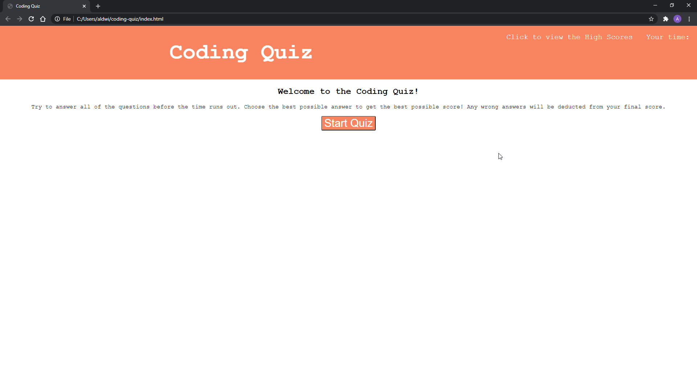

# coding-quiz

## An Overview:

In this week's assignment we were ordered to create a coding quiz from scratch which allows the user to click a button to begin the quiz. The screen would then change to the first question and, as soon as the user chooses an answer, the next question will appear. This is also done while there is a timer countdown present on the screen where the quiz would end once the time runs out. The results of the quiz would be presented in the end and would allow the user to enter their initals which they would then press a button to submit it. The user would be able to click the link called "Click to view the High Scores" and a table would pop up to show the highest scores.

With the help of the study group, I was able to get as far as printing the main page where the "Start Quiz" button appears and a set of instructions. However, I could not get the rest of the questions to appear. The timer countdown did work once the "Start Quiz" button was clicked. I was not able to figure out how to add correct and incorrect alerts whilst changing between questions nor how to store the score of the user where it would then be presented in the end. The link to the "High Score" board would not 

## Link to Git Hub Pages:

https://aldwinlub.github.io/coding-quiz/

## Screenshots:

